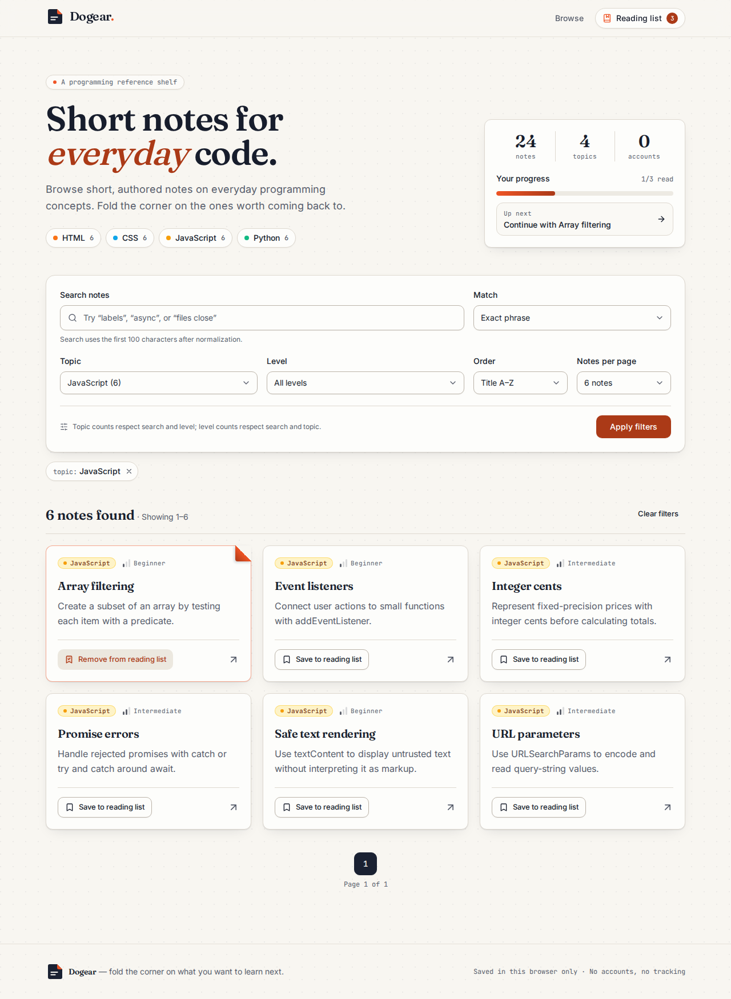
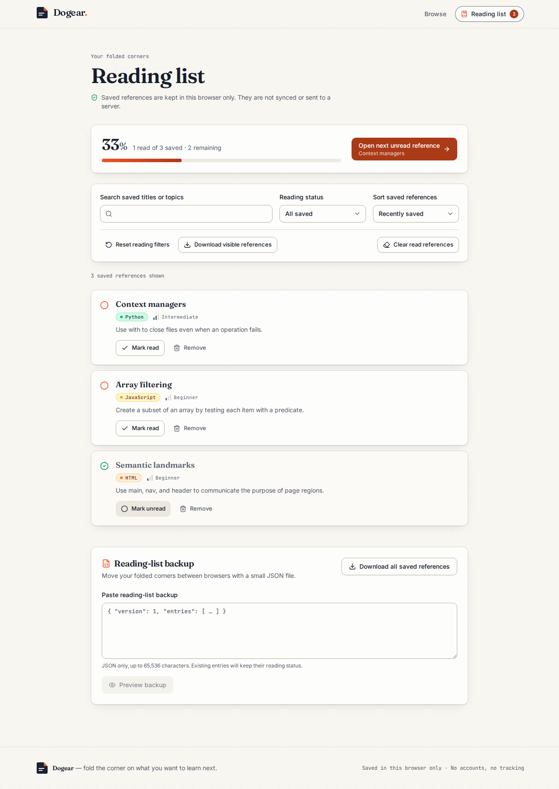

# Dogear

**Short notes for everyday code.** Browse 24 concise programming references, fold the corner on the ones worth coming back to, track what you've read, and move your list with reviewed JSON backups.

The name comes from folding down a page corner to mark your place. Saved notes show a vermilion folded corner, and the logo is a page with its corner turned down.



## Design

- **Palette:** warm paper background, deep ink text, and one vermilion accent for the fold. Tokens are shadcn-style HSL CSS variables in `app/globals.css`, with a matching dark theme that follows `prefers-color-scheme`.
- **Type:** Fraunces for display headings, Inter for interface text, and JetBrains Mono for metadata. All three are self-hosted through Fontsource, so builds make no font network requests.
- **Components:** shadcn/ui-style primitives in `components/ui/`: Button, Input, Card, Alert, Progress, Skeleton, Textarea, and a styled `NativeSelect`. Native `<select>` elements keep the catalog form working without JavaScript.
- **Topic colors:** HTML, CSS, JavaScript, and Python each have a color that appears on badges, topic chips, and dots.
- **Icons:** Client components use `lucide-react`. Server components use inline copies of the same paths from `components/icons.tsx`.
- **Accessibility:** accessible names are unchanged from before the redesign. Focus rings are visible, brand fills meet WCAG AA contrast, and animation is disabled under `prefers-reduced-motion`.

## Run

Use Node 20, then:

```sh
npm ci
npm run dev -- --hostname 127.0.0.1
```

Open `http://localhost:3000`. For a production build, run `npm run build` followed by `npm start -- --hostname 127.0.0.1`.

The current stack is Next.js 15.5.2, React 19.1.1, TypeScript 5.9.2, Tailwind CSS 3.4.1, lucide-react 0.542.0, and Fontsource variable fonts. Local checks used Node 20.19.0; CI pins 20.19.5.

## Browse and read

- Match an exact phrase or every search word, then combine topic and level filters.
- Sort by reference order, title in either direction, or topic and title; show six or twelve notes per page.
- Remove one active filter without discarding the rest. Empty results suggest specific constraints to relax.
- Open a reference and return to the same search, or follow adjacent and related references within its topic.

The native GET form, pagination, and reading links work without JavaScript. URLs preserve the submitted view. Search uses Unicode NFKC normalization, whitespace normalization, and the first 100 Unicode code points. Repeated parameters and unknown choices fall back to defaults. Page numbers are bounded to available results.

Topic counts apply search and level but ignore the selected topic; level counts apply search and topic but ignore the selected level. This explains why the choices can show counts beyond the current results.

The index is server-rendered. `generateStaticParams` enumerates the 24 allowed note identifiers, while detail pages read the request's validated return context. Unknown identifiers return HTTP 404. The index has no `loading.tsx` boundary. React outlines any completed Suspense boundary larger than its progressive chunk size, which would leave JavaScript-disabled visitors on the fallback. The index renders from in-memory data, so it streams as one response. Filtered index variants have noindex metadata.

## Save for later

Save references from cards (the card's corner folds over) or detail pages, mark them read, search and sort the saved list, and continue to the next unread entry. Confirm before clearing completed entries. Download the complete list or visible subset; paste a backup, review its counts, then merge. Existing saved entries keep their current status.

These features require JavaScript and stay in one browser. There is no account or synchronization. Invalid or blocked storage is preserved, with explicit reload recovery. Stale-write checks reduce accidental overwrites but localStorage is not transactional across tabs. Reading-list view filters reset when leaving the page. See [backup format and recovery](docs/reading-list.md).



## Checks and measurements

```sh
npm test
npm run typecheck
npm run build
npm run benchmark
```

Tests cover composed filters, ordering, facet counts, page bounds, Unicode, authored metadata, safe return URLs, reading state, backup bounds, and stale-write guards. Browser checks cover all 24 details, malformed-route 404 responses, keyboard navigation, 100-emoji searches, narrow screens, and JavaScript-disabled workflows. Reading-list browser checks cover reload persistence, status changes, filtered downloads, cancel/edit invalidation, current-state merging, stale tabs, corrupt/blocked storage, and focus recovery. The preview above is an actual application screenshot.

With Playwright available externally and the production server running, execute `node tests/browser-old.cjs` and `node tests/browser-new.cjs`, `node tests/browser-keyboard.cjs`, and `node tests/browser-navigation.cjs`. Set `CATALOG_URL` to the server origin; it defaults to `http://127.0.0.1:8605`. No browser dependency is required for ordinary unit checks.

A repeated-query microbenchmark on the real 24-entry collection measured a median **68.093 ms before and 6.614 ms after** for 2,400 evaluations in one run. Precomputed search text and shared facet passes reduce repeated query work. These are in-process measurements, not page-load timings or evidence of a noticeable user-facing improvement. See [the reproducible benchmark](benchmarks/README.md) for rounds, parity checks, and limitations.

## Scope and credits

Content is authored locally in `lib/catalog.ts`. Reading-list persistence uses browser localStorage; there is no account or database. The pinned dependencies have known advisories; review and upgrade them before production deployment.

The shadcn/ui Button and Input started from revision [`c21ecfb665214e18cd5914ea319f925cd676e786`](https://github.com/shadcn-ui/ui/tree/c21ecfb665214e18cd5914ea319f925cd676e786) and have since been restyled for the Dogear theme. The other primitives in `components/ui/` follow shadcn/ui patterns. The MIT notice is retained in `SHADCN-LICENSE.md`. Icon paths in `components/icons.tsx` come from Lucide (ISC).
